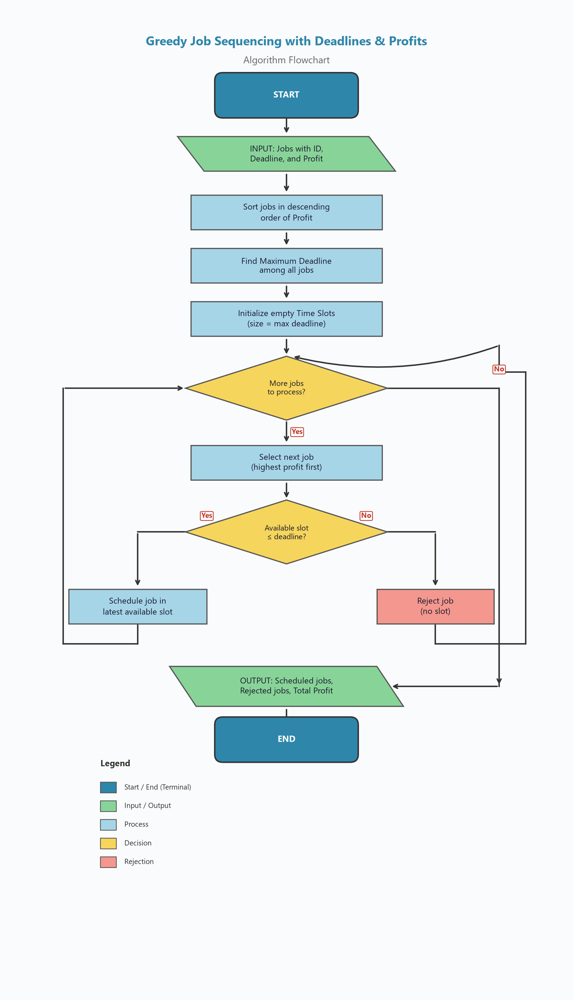

# Greedy Job Sequencing with Deadlines and Profits

## Description

This project implements the **Greedy Job Sequencing** algorithm, a classic problem in the Design and Analysis of Algorithms (DAA). Given a set of jobs—each with a unique ID, a deadline, and a profit—the objective is to schedule jobs on a single machine so that the **total profit is maximized**. Each job requires exactly one unit of time, and it must be completed on or before its deadline.

The greedy strategy works by always considering the most profitable unscheduled job first and assigning it to the latest available time slot before its deadline. This locally optimal choice leads to a globally optimal solution.

---

## Algorithm

1. **Input** a list of jobs with their IDs, deadlines, and profits.
2. **Sort** all jobs in **descending order of profit**.
3. **Find the maximum deadline** to determine the total number of available time slots.
4. **Initialize** an array of time slots (size = max deadline), all set to empty.
5. **For each job** (in sorted order):
   - Try to place the job in the **latest available slot** on or before its deadline.
   - If a slot is found → **schedule** the job.
   - If no slot is available → **reject** the job.
6. **Output** the scheduled jobs, rejected jobs, and the maximum total profit.

---

## Pseudocode

```
GREEDY-JOB-SEQUENCING(Jobs)

    // Step 1: Sort by profit (descending)
    Sort Jobs in decreasing order of profit

    // Step 2: Find max deadline
    max_deadline ← maximum deadline among all jobs

    // Step 3: Initialize slots
    Create array Slots[1 .. max_deadline], all set to EMPTY

    // Step 4: Schedule jobs
    scheduled ← empty list
    rejected  ← empty list

    FOR each job J in sorted Jobs:
        FOR slot ← min(J.deadline, max_deadline) DOWNTO 1:
            IF Slots[slot] == EMPTY:
                Slots[slot] ← J
                Append J to scheduled
                BREAK
        IF J was not placed:
            Append J to rejected

    // Step 5: Compute total profit
    total_profit ← SUM of profits of all jobs in scheduled

    RETURN scheduled, rejected, total_profit
```

---

## Prompt Used

The prompt used to generate the flowchart is stored in [`Prompt.txt`](Prompt.txt). It describes every step—from Start and Input through sorting, slot initialization, scheduling decisions (with Yes/No branches), to the final Output and End—using standard flowchart symbols.

---

## Flowchart



---

## Time and Space Complexity

| Aspect | Complexity | Explanation |
|---|---|---|
| **Sorting** | O(n log n) | Sorting *n* jobs by profit |
| **Scheduling** | O(n × d) | For each of *n* jobs, search up to *d* slots (where *d* = max deadline) |
| **Overall Time** | **O(n × d)** | Dominated by the scheduling loop (since typically *d* ≤ *n*) |
| **Space** | **O(d)** | Slot array of size *d* (plus O(n) for input storage) |

> **Note:** Using a Disjoint Set (Union-Find) data structure, the scheduling step can be optimized to nearly O(n × α(d)), where α is the inverse Ackermann function—effectively O(n) for all practical purposes.

---

## Sample Input and Output

### Input

| Job | Deadline | Profit |
|---|---:|---:|
| J1 | 2 | 100 |
| J2 | 1 | 19 |
| J3 | 2 | 27 |
| J4 | 1 | 25 |
| J5 | 3 | 15 |

### Processing Steps

1. **Sort by profit (descending):** J1 (100), J3 (27), J4 (25), J2 (19), J5 (15)
2. **Max deadline:** 3 → Slots = [Empty, Empty, Empty]
3. **Schedule J1 (deadline 2):** Place in Slot 2 → Slots = [Empty, **J1**, Empty]
4. **Schedule J3 (deadline 2):** Slot 2 taken, try Slot 1 → Slots = [**J3**, J1, Empty]
5. **Schedule J4 (deadline 1):** Slot 1 taken → **Rejected**
6. **Schedule J2 (deadline 1):** Slot 1 taken → **Rejected**
7. **Schedule J5 (deadline 3):** Place in Slot 3 → Slots = [J3, J1, **J5**]

### Output

```
  Time-Slot Assignment:
  ------------------------------
  Slot     Job ID
  ------------------------------
  1        J3
  2        J1
  3        J5
  ------------------------------

  Scheduled Jobs: J1, J3, J5
  Rejected Jobs:  J4, J2

  ★  Maximum Total Profit: 142
```

---

## Learning Outcomes

- **Greedy Strategy:** Understood how making locally optimal choices (highest profit first) yields a globally optimal solution for this problem.
- **Scheduling Problems:** Learned to model real-world scheduling constraints (deadlines, limited resources) as algorithmic problems.
- **Slot-Based Assignment:** Practiced the technique of assigning tasks to the latest available slot to preserve flexibility for future assignments.
- **Time–Space Trade-offs:** Analyzed the trade-off between the simple O(n × d) approach and advanced data structures like Union-Find.
- **Input Validation:** Implemented robust validation to handle edge cases and invalid data gracefully.
- **Algorithm Correctness:** Verified the algorithm produces the expected optimal profit of **142** for the given dataset.

---

*Design and Analysis of Algorithms — DAA-538*
