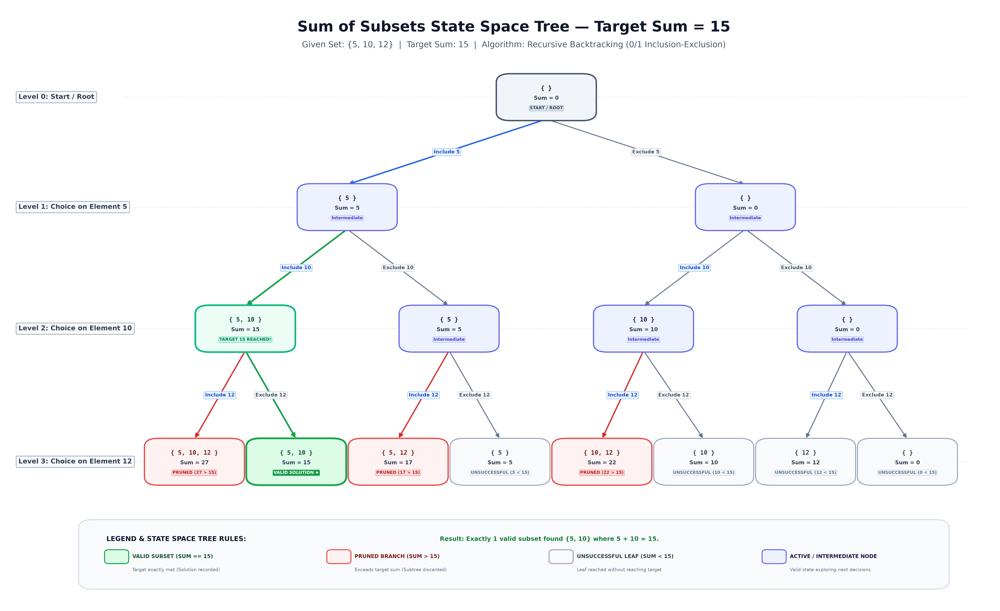

# Sum of Subsets using Backtracking

## Description
This project implements the Sum of Subsets problem using backtracking and visualizes the state space tree through prompt engineering.

Given a set of positive integers \( S = \{5, 10, 12\} \) and a target sum \( M = 15 \), the algorithm finds all unique subsets whose elements add up exactly to 15. It builds subsets incrementally using a 0/1 decision tree: at each step, it either **includes** or **excludes** the current element. If the running sum exceeds 15, the branch is **pruned** immediately because all elements are positive, avoiding unnecessary exploration. When the sum equals 15, the subset is recorded as a solution.

---

## Algorithm

### Pseudocode:
```pascal
procedure findSubsets(index, currentSubset, currentSum, targetSum, S):
    // Base Case 1: Target reached
    if currentSum == targetSum then
        recordSolution(currentSubset)
        return
    end if

    // Base Case 2: Pruning condition (Bounding Function)
    if currentSum > targetSum then
        return  // Pruning: sum exceeds target
    end if

    // Base Case 3: Reached end of array
    if index >= length(S) then
        return
    end if

    // Choice 1: Include S[index]
    currentSubset.append(S[index])
    findSubsets(index + 1, currentSubset, currentSum + S[index], targetSum, S)

    // Backtracking Step: Undo inclusion
    currentSubset.pop()

    // Choice 2: Exclude S[index]
    findSubsets(index + 1, currentSubset, currentSum, targetSum, S)
end procedure
```

---

## Prompt Used
“Draw a complete state space tree for the Sum of Subsets problem using backtracking with the input set {5, 10, 12} and target sum 15. Start from an empty subset with sum 0. At each level, branch into Include and Exclude decisions for the next element. Label every node with the current subset and sum. Highlight the valid subset {5, 10} in green, branches exceeding 15 in red, and completed unsuccessful branches in a neutral color. Use directional arrows, clear labels, and a top-to-bottom tree layout. Generate an accurate, high-resolution PNG suitable for a B.Tech Computer Science assignment.”

---

## Output



### Terminal Execution Output:
```text
=============================================
    SUM OF SUBSETS USING BACKTRACKING
=============================================
Input Set   : {5, 10, 12}
Target Sum  : 15
---------------------------------------------
Valid Subset Found: {5, 10} (Sum = 15)
=============================================
```

---

## Learning Outcome
- Understood recursive backtracking.
- Learned prompt-based visualization.
- Practiced GitHub documentation.
